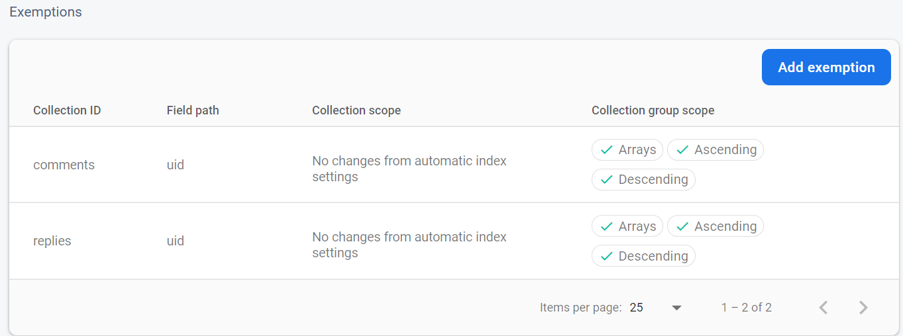

# React Native Instagram clone clone <!-- omit in toc -->

This is a react native project written during my mobile programming course, based on [original git repo](https://github.com/iamvucms/react-native-instagram-clone)


## Contents of this Document <!-- omit in toc -->
- [Project structures](#project-structures)
- [Enable Firebase support](#enable-firebase-support)
  - [NOTE](#note)
  - [Firestore indexes](#firestore-indexes)
- [Install this app](#install-this-app)
- [Generate apk release build](#generate-apk-release-build)
- [A little demo](#a-little-demo)
- [Troubleshooting](#troubleshooting)
  - [GradleWrapperMain not found](#gradlewrappermain-not-found)
  - [Icon not display correctly](#icon-not-display-correctly)
- [A tour around source code](#a-tour-around-source-code)


## Project structures

    .
    ├── android                # Android native code
    ├── image                  # App screen demo
    ├── ios                    # Ios native code
    ├── node_modules           # Contains libraries downloaded from npm for js
    ├── src                    # Source files (alternatively `lib` or `app`)
    ├── .buckconfig
    ├── .editorconfig
    ├── .eslintrc.js
    ├── .gitattributes
    ├── .gitignore             # node_modules belongs here
    ├── .prettierrc.js
    ├── .watchmanconfig
    ├── app.json               # App general info
    ├── App.tsx                # Wrap redux, persist, handle user active state
    ├── babel.config.jse
    ├── index.js               # App main entry point
    ├── metro.config.js
    ├── package.json           # Magic to be downloaded
    ├── README.md
    └── yarn.lock              # Yarn magic


## Enable Firebase support
1. [Add firebase to your android app](https://firebase.google.com/docs/android/setup)
2. [Create a Firebase Cloud Firestore database](https://firebase.google.com/docs/firestore/quickstart#create)
3. [Create a default Firebase Cloud Storage bucket](https://firebase.google.com/docs/storage/android/start#create-default-bucket)
4. [Create a Firebase Realtime Database](https://firebase.google.com/docs/database/android/start#create_a_database)

### NOTE

Edit **FIREBASE_DATABASE_URL** in [src/constants/index.ts](./src/constants/index.ts) to match your Firebase Realtime Database as noted in [here](https://rnfirebase.io/database/usage#references)

### Firestore indexes
In order for the app to query firestore properly, the following index must be created.
- Composite indexes

    

- Single Field indexes

    

[How to create indexes](https://firebase.google.com/docs/firestore/query-data/index-overview)

## Install this app
(make sure to first [enable firebase](#enable-firebase-support))
1. Clone this repository:

```bash
git clone https://github.com/vohoanglong0107/react-native-instagram-clone/tree/fix-runable
```

2. Install dependencies:

```bash
yarn install
```

- if you haven't install yarn yet, try

```bash
npm install
```

- or [install yarn](https://classic.yarnpkg.com/lang/en/docs/install/#windows-stable)

3. Connect your phone (Emulator works too) (Android only, ios have yet to be tested)
4. (Optional) open a new terminal, run below command to run a new react devtools for debugging purpose

```bash
adb reverse tcp:8097 tcp:8097
npx react-devtools
```

5. Run app on your android

```bash
yarn android
```

6. Enjoy

## Generate apk release build
Follow instruction from [here](https://www.instamobile.io/android-development/generate-react-native-release-build-android/)
1. Generate a keystore

```bash
keytool -genkey -v -keystore your_key_name.keystore -alias your_key_alias -keyalg RSA -keysize 2048 -validity 10000
```

2. Adding Keystore to your project

```bash
mv my-release-key.keystore /android/app
```

3. Change [android/app/build.gradle](./android/app/build.gradle)
```
android {
....
    signingConfigs {
        release {
        storeFile file('your_key_name.keystore')
        storePassword 'your_key_store_password'
        keyAlias 'your_key_alias'
        keyPassword 'your_key_file_alias_password'
        }
    }
    buildTypes {
        release {
        ....
        signingConfig signingConfigs.release
        }
    }
}
```

4. Release APK Generation
```
cd android
./gradlew assembleRelease
```

## A little demo
1. App login screen:

   

2. Welcome screen:

   

3. Home screen:

   

4. Profile Screen:

   

5. Story taking screen:

   

## Troubleshooting

### GradleWrapperMain not found
So if you ever wander around and found out this during build time

    Error: Could not find or load main class
    org.gradle.wrapper.GradleWrapperMain
    Caused by: java.lang.ClassNotFoundException:
    org.gradle.wrapper.GradleWrapperMain

Move this repo to another path, which should not contain any white space and special character.

### Icon not display correctly
So if when you run your app, Icon just doesn't like to show up or they just want to hide behind some weird rectangle, follow instruction [here](https://github.com/oblador/react-native-vector-icons#android)

## A tour around source code
See [here](./src/README.md)